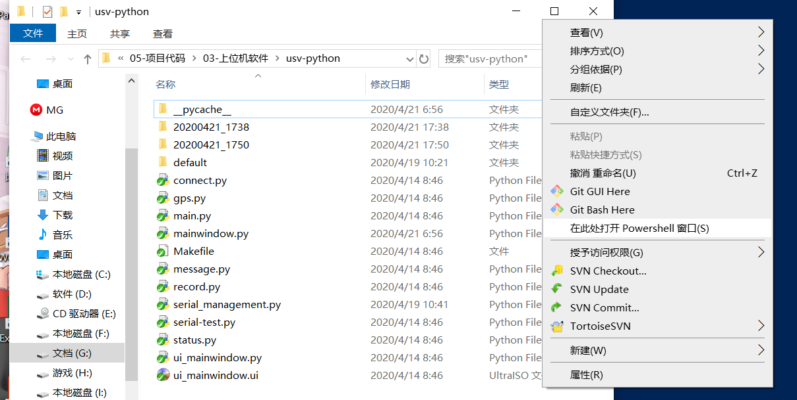
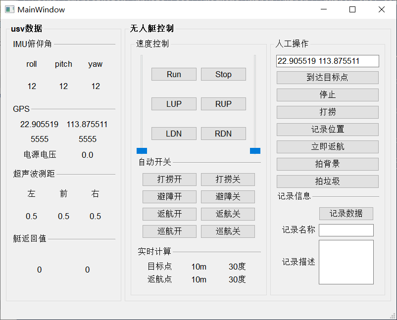

# 第一版无人艇python上位机文档
---

## 搭建运行环境
该软件依赖于python3，pyqt5，pyserial。假设你的电脑里已经存在python3，使用pip安装剩下的两个包
``` sh
pip install pyqt5
pip install pyserial
```

## 如何运行
该软件必须使用命令行运行，因为必须在命令行参数的第一项输入串口名。
```
# com3 修改为实际的串口
python main.py com3
```
### 如何在windows当前目录打开终端
按住shift在目录空白处单击右键，在弹出框中选择`在此处打开Powershell窗口`


## 使用说明

### 实时计算
该功能无效
### 记录信息
默认将usv数据中的信息存储在default文件夹中。输入记录名称然后按下记录数据，会将存储文件夹修改为记录名称的文件夹。

## 代码描述
没有描述的不是源文件或者是测试代码
- `connect.py`每秒发送一条connect报文保持连接
- `gps.py`计算gps距离信息，无效
- `main.py`主程序入口
- `ui_mainwindow.ui`使用qtdesigner设计的界面文件
- `ui_mainwindow.py`由uic生成的界面文件
- `mainwindow.py`调用ui_mainwindow.py界面绘制窗口，定义槽函数
- `message.py`报文类，用于解析和构建报文
- `serial_management.py`管理串口类，包括读串口线程，写串口槽函数
